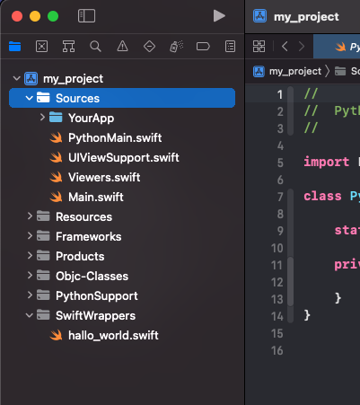

==========================
Making your first wrapper:
==========================

Part 1
======

In this example a project with the name ``my_project`` was used.
Open the Xcode project. (my_project-ios)

Click on File -> New -> File

.. image:: ../../../examples/hello_world/images/xcode_select_new_file.png

.. image:: ../../../examples/hello_world/images/xcode_select_swift_file.png

name it 'HelloWorld.swift' and paste the following:

HelloWorld.swift
"""""""""""""""""
.. literalinclude:: ../../../examples/hello_world/HelloWorld.swift
   :language: swift

hello_world.py
""""""""""""""

in ``Finder`` goto 

.. code-block:: sh

   <working_folder>/my_project-ios/wrapper_sources

and create a new file called

.. code-block:: sh

   hello_world.py

and paste the following:

.. literalinclude:: ../../../examples/hello_world/hello_world.py
   :language: python

Part 2
======
        
        
Api:
****
.. autoclass:: hello_world.HelloWorld
    :members:
    :noindex:

.. autoclass:: hello_world.HelloWorld.Callbacks
   :members: